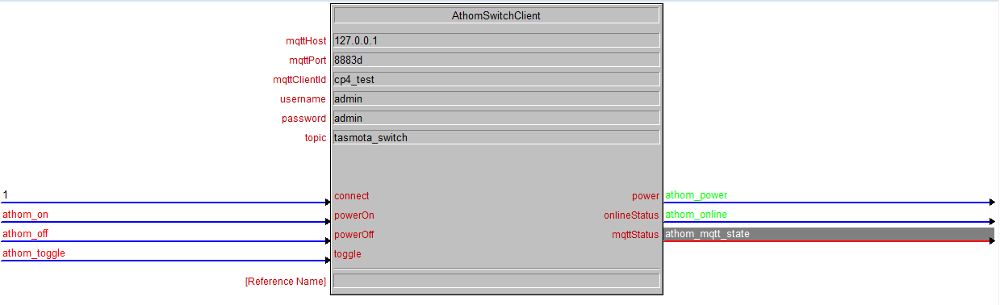

# Crestron Simpl+ Module for Athom 3-way Relay Switch

## About

- Only compatible with 4-series processor or above
- [You can buy the module here](https://www.athom.tech/blank-1/3-way-relay-for-esphome)
- Control the Athom 3-way relay switch via MQTT
- Received feedback from the relay switch via MQTT
- Simpl# library using MQTTNet as MQTT client library

## How to use the module

1.Build the Simpl# library first.

``` powershell
dotnet restore // Add the reference of all the required library
dotnet build // Build the library
```

The .clz file should be inside the bin folder after the build

2.Change the Simpl# library path in the Simpl+ source file (AthomSwitchClient.usp)

``` c
#includepath //copy your library path to here
#USER_SIMPLSHARP_LIBRARY "AthomSwitch"
```

3.Open the Simpl+ source file with Simpl+ Editor and build the driver (F12)

4.Move the Simpl+ module into the same directory of your Simpl Window Project

5.Enter all the configuration information in the parameter



Make sure that the configuration in the Simpl Window is the same as the one you made in the Athom 3-way Relay Switch

**You need to set up your own MQTT broker for this module to work**
